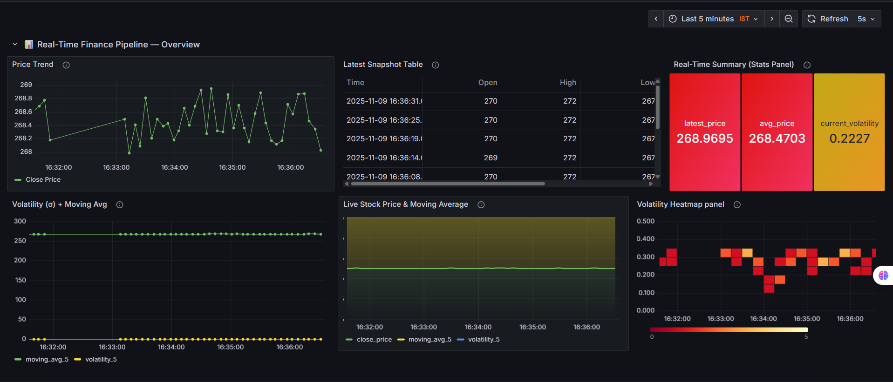

# 💹 Real-Time Finance Pipeline

A real-time data engineering project that streams live stock market data using **Apache Kafka**, stores it in **PostgreSQL**, and visualizes insights in **Grafana**.

---

## 🚀 Architecture Overview
**Pipeline:**  
`Finnhub API → Kafka Producer → Kafka Broker → Kafka Consumer → PostgreSQL → Grafana Dashboard`

---

## ⚙️ Tech Stack
- **Python** — Kafka Producer & Consumer
- **Apache Kafka** — Real-time data streaming
- **PostgreSQL** — Storage backend
- **Grafana** — Real-time dashboard & alerts
- **Finnhub API** — Live stock market data source

---

## 📊 Dashboard Panels
- **Real-Time Summary Panel** (latest price, avg price, volatility)
- **Live Stock Price & Moving Average**
- **Volatility Heatmap**
- **Price Trend Chart**
- **Latest Snapshot Table**

---

## 🧠 Alerting
Grafana email alerts trigger when volatility exceeds a threshold.

---

## 🧾 Example Dashboard


---

## 🔧 Setup Instructions
1. Start Zookeeper & Kafka:
   ```bash
   .\bin\windows\zookeeper-server-start.bat .\config\zookeeper.properties
   .\bin\windows\kafka-server-start.bat .\config\server.properties
